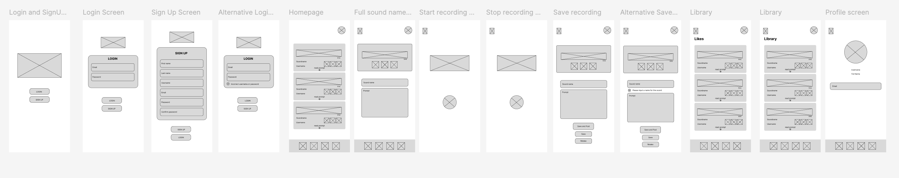
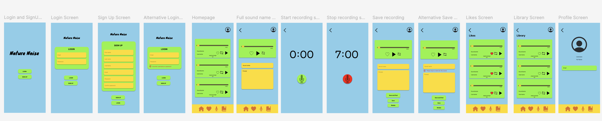
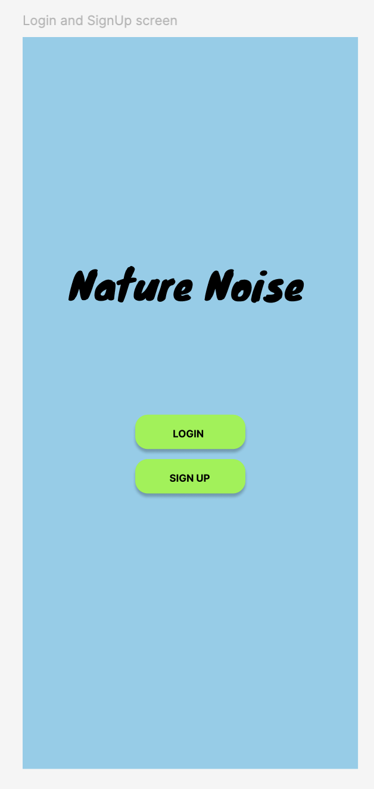
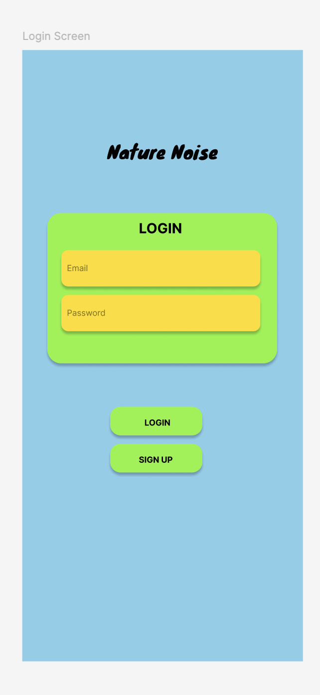
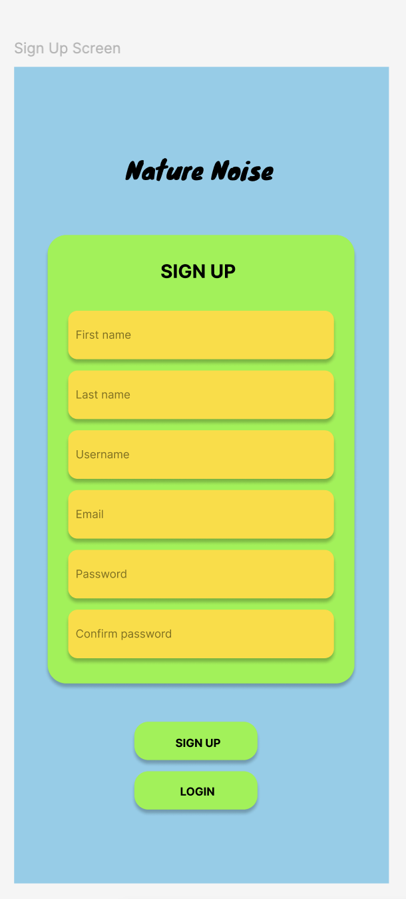
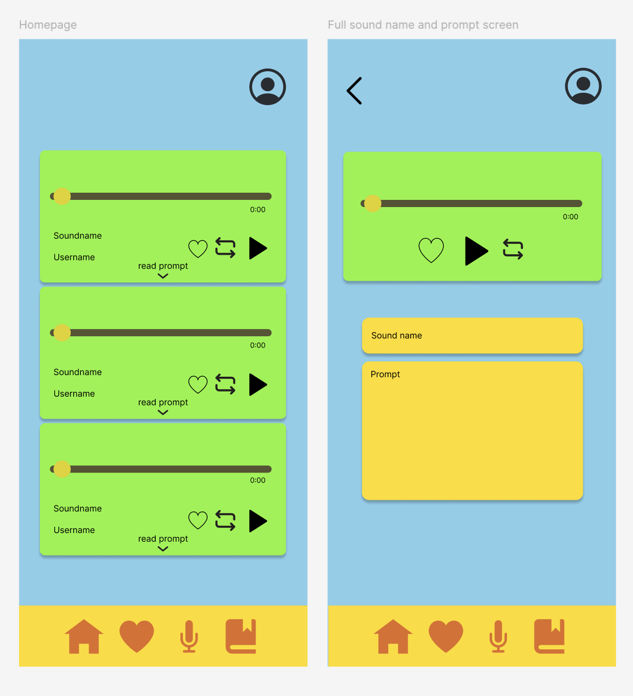
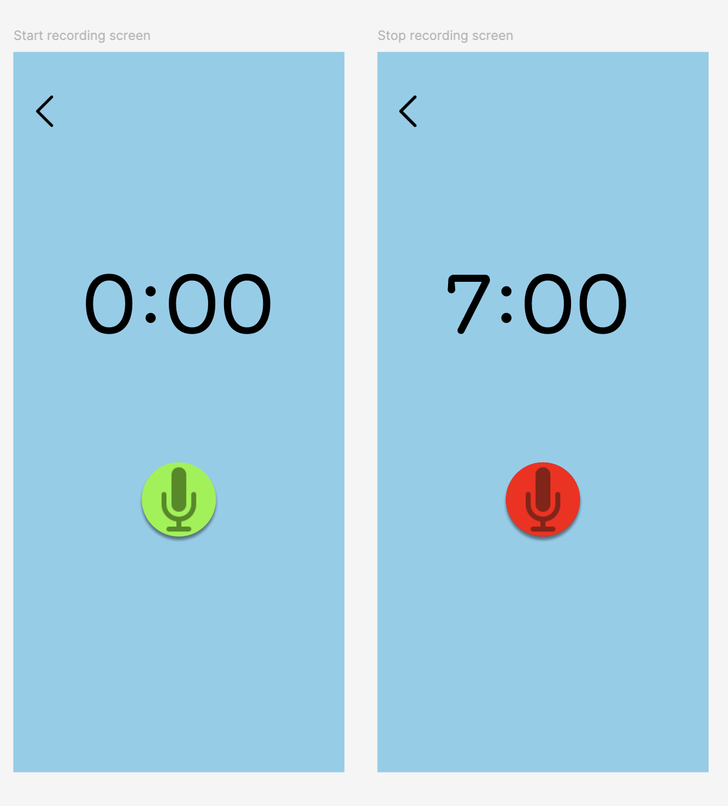
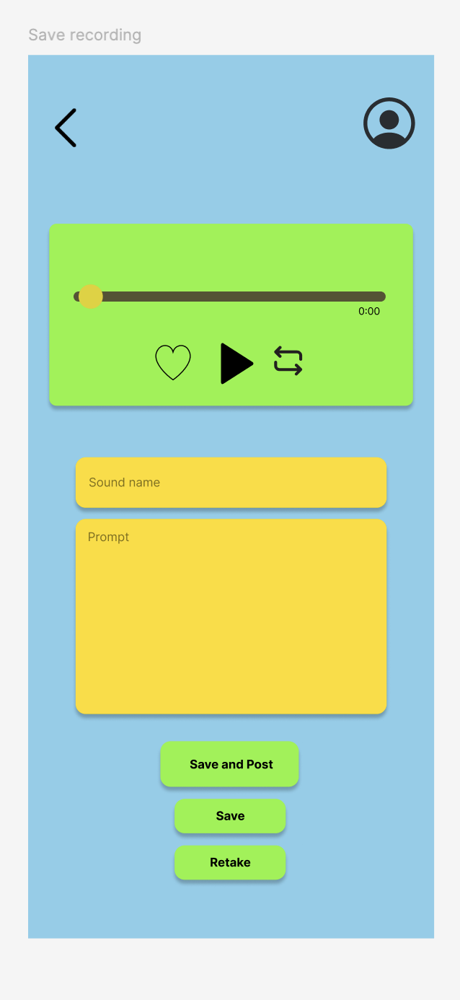
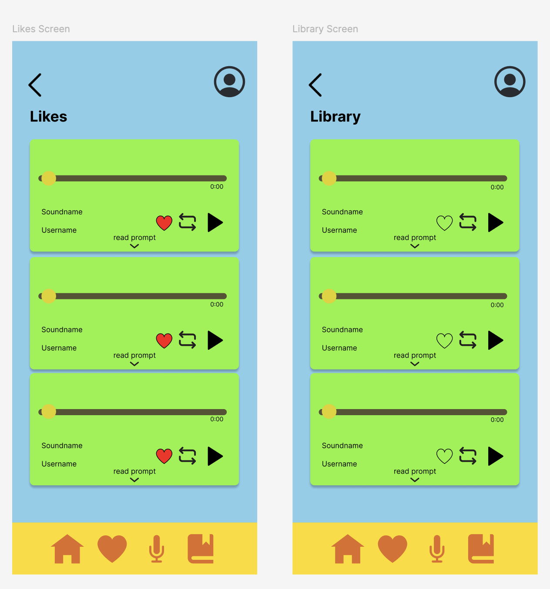
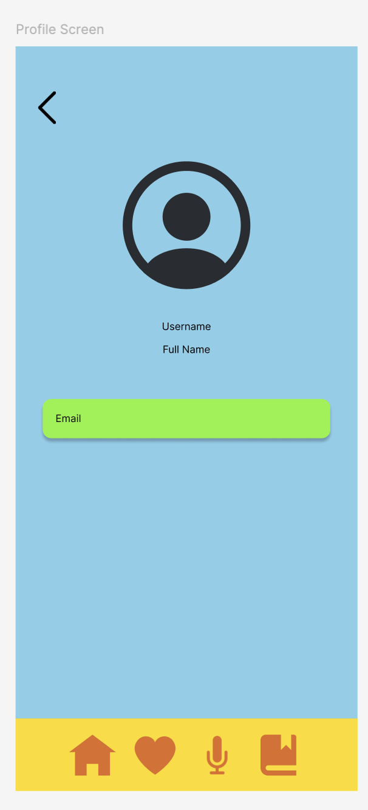

# Mobile App Design

## Application Title 

The chosen app is the environmental noise recording app. The app is called "Nature Noise". 

### Tagline

"Record and hear a new world of sounds"

## Application Description

Nature Noise is an app to record environmental sounds that users can post for others to see. The recorded sound will be posted with the name of the sound and the user's username. The application will allow users to post and listen to various sounds from the natural environment. Users have the option to also add a prompt to include with the sound. The prompt can be a description of the place and surrounding environment or a fictional prompt to help the audience imagine and visualise a place in their mind. The purpose of the prompt is to help people who would like to work on their visualisation and escape reality through sounds. In addition, this prompt allows users who cannot hear to understand the nature of the sound through a prompt the user creates. This will help make the app more accessible to more users. The application is made to share beautiful environmental sounds with more people. This creates a shared experience online using the users’ auditory senses. 

Furthermore, the application has other uses such as for studying with white noise, resting or reading books. For example, users can use specific sounds and analyse prompts to match the environment in the novel to enhance their experience. Users can improve their auditory senses and build a habit of identifying sounds around them. Users can also improve their sleeping through white noise. The library function for sounds the user has recorded over time can be used as a memory shelf where users can visualise past experiences through sounds. Nature Noise aims to emphasise the benefits of listening to, sharing and storing sounds. Overall, Nature Noise is an application that helps users record and listen to environmental sounds. 
 
## Main Features of the Application

### Colour Scheme 

The colour chosen for the app represents the bright colours of the environment such as sky blue, lime green and sunflower yellow. This was chosen on purpose to match the theme of the app, which is environmental sounds. 

### Authentication Screen

The user first needs to sign up if they have not yet had an account. The user signs up with first name, last name, username, email, password and confirm password. The user can then log in with an email and password. 

### Home Screen

The home page contains a profile button, noise recordings that other users have posted, and a bottom navigation with a home, likes, microphone and a library button. In each of the recordings, there is a noise scrolling function that allows users to manipulate the time of the recording, a like button, a loop button and a play button. There is also a reading prompt with an arrow key pointing downwards that will take users to an expanded screen for the recording. If the users press the like button the recording will be added to their likes screen. 

### Bottom Navigation and other Screens

#### Likes and Library 

The bottom navigation has a home button that takes the users back to the home screen when pressed. The heart button represents the user's likes and will take the users to their likes screen whenever pressed from the bottom navigation. Similarly, the library button will take users to the recordings they have made in the past.

#### Recording Noise Feature

The microphone button takes the users to a screen with a circular green microphone button where the user can start recording the sound. Once the green microphone button is pressed the button will turn red and the time will start. The button will then turn red and will stop the recording when pressed. Once the user has finished recording, the user will be taken to a screen where they will input the sound name, and prompt (optional), and can choose to either save and post, save to the library only or retake the recording.   

### Back button feature and Profile 

There is also a back button at each of the screens that takes the users back to previous screens after moving from the home screen. The profile icon button at the top right corner takes the users the screen takes the users to the profile screen where they can add and see their profile picture, username, full name and email.

## Users of the Application 

### User Groups

The users of the Nature Noise application would like to take time in their day to rest their eyes and minimise distractions. Users of the application can use features such as the repeat button to continually listen to white noise and focus on completing tasks such as studying. Nature Noise is also suitable for nature enthusiasts who would like to capture memories through sound and descriptions. Users of the app would be students, nature enthusiasts, book lovers, and minimalists. The target age group of the users would range from young adults to older adults. 

### User Personas

1. Description: Daniel is reaching the end of his undergraduate study and learnt that white noise helps him to focus and stay productive while studying. He loves to listen to the sound of the sea and rustling leaves.
    
    * Name: Daniel
    * Age: 21
    * Occupation: Full-time undergraduate student 
    * Motivations: Completing his degree and using experiences he learnt to gain a job. A quiet and clean space to study.
    * Frustrations: Distractions when studying or trying to complete a task.
    * Goals: To achieve the highest grade in the final units of his degree.

2. Description: Molly is a librarian who loves to read books and go on occasional hikes to stay active. She has many hobbies such as completing puzzles and knitting. She learnt that white noise helps her to focus and appreciate the environment around her.
    
    * Name: Molly
    * Age: 45
    * Occupation: Librarian 
    * Motivations: To help people gain new experiences through reading while not neglecting real-life experiences. Molly would also love to record interesting natural noises she comes across during her hikes.
    * Frustrations: Loud distractive noises and environments. 
    * Goals: To maximise her quiet hobbies through white noise.

### Use of Nature Noise and Edge Over Competitors

There are many ways in which the Nature Noise can be used. Users may decide to use environmental sounds recorded by others to focus on completing specific tasks such as studying or puzzle solving. Users can also choose to create their library of environmental sounds and choose to share them with others through the app. The prompt will help users to understand the context of the sound. Additionally, users can enhance their reading experiences by matching the specific noise to the setting in the book. This app will also help people with trouble sleeping as white noise can help with sleep. Additionally, users can use the app to create a sound diary by using the library and prompt feature. Therefore, the app can be used in various ways such as to focus, sleep, enhance the experience and create a diary through sound.

Users would pick Nature Noise over competitors as we are solely focused on the benefits of using environmental noise. As previously discussed, Nature Noise have added extra features around the use of sound such as prompts, repeat features, recording features, and shareability features that maximise the concept of sound. I believe this gives Nature Noise a competitive edge as it maximises the use of sound while also minimising the distracting features that would worsen productivity.

## App Design 

### Wireframes

Wireframes of the Noise Nature app aims to show the raw minimalistic design. This is to help users to grow accustomed to the app easily. The wireframes highlight where icons and logos are going to be placed in the app. Alternative screens are included to show what would happen if a user inputs an incorrect password or does not input a sound name.

### Mockups

The mockups highlight the app design features that were highlighted previously in the "Main Features of the Application section. Noise Nature’s main colour scheme will include sky blue, lime green and sunflower yellow to emphasise the bright colours of nature.  

#### Start Screen

  
The start screen has two buttons a login button and a sign-up button. If the users select the login button, they will be taken to the login screen. If the users select the sign-up button the users will be taken to the sign up screen.

#### Login Screen

  
The login screen will require the user to input their email and password for the application to authenticate the user. Once the user places their email and password correctly, they will be taken to the home page.

#### Sign Up Screen

  
The sign-up screen will require the user to input their first name, last name, username, email, password, and confirm password. The user will need to input their chosen password twice to confirm it. Once the user has input all their details and pressed the sign-up button, they will be taken to the login screen to log in.

#### Home Screen and Read more Screen

  
The home screen is the first screen the users will see once authenticated. The home screen contains recording other users have posted on the app. Users can play, repeat and like recordings. Users can scroll through the recording. The profile icon button will have the user’s picture and take the users to the profile screen when pressed. 

There is also a bottom navigation that will help users to navigate themselves around the app. The home button will take the users to the home screen, the likes button will take the users to their likes screen, the microphone button will take the users the start recording screen and the library button will take the users to their library screen.

The users can also choose to press the read prompt button with the down sign that will take the users to a screen that expands the prompt with the recording. There will be a back button for every screen after the home page to take users back to previous screens.

#### Record Screen

  
There will be timer and a green button with a microphone on it that will start the timer when pressed. The users can they start recording noises. The button will then turn red, and the users and the timer will stop when pressed indicating that the recording has finished. This will automatically take the users to the Save recording screen where users will input recording information.

#### Save Recording

  

The save recording screen will allow the users to replay the recorded sound. The users will then need to input the name of the sound and may optionally choose to input a prompt. The users can then press the save and post buttons, and they will be taken back to the home screen and their recording will be posted. The users can also choose to only save the recording or retake the recording where they will be taken back to the home screen or microphone screen respectively.

#### Likes and Library Screens

  

The likes screen will have the user’s liked recordings saved and Users can scroll through the recordings. If the user presses the like button on the recording, the recording will be removed from their likes screen. The likes screen will also have a bottom navigation.

Similarly, the library screen will have all of the users past recordings saved. The library screen also had a bottom nabvigation.

#### Profile Screen

  

The users will be taken to the profile screen whenever the profile button is pressed. The profile icon is on every screen after user authentication. 

## Minimum Viable Product (MVP)

In the MVP there will be authentication screens for the users to be authenticated into the app. The home screen with the bottom navigation will be included. However, recordings other users have posted may not be included and be replaced with recordings the user have recorded for the MVP. The like functionality may also be left out in the MVP. The microphone recording screen is a necessity to record the noise. The library screen will also be included in the MVP to store the user’s recordings. The profile icon button and the screen may also be left out of the MVP.  The back button at every screen may also be left out of the MVP. The focus of the MVP is the noise recording functionality and information input of the noise. 
